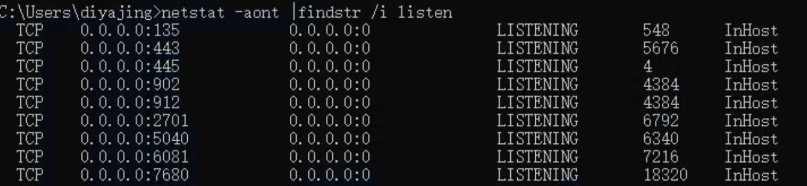
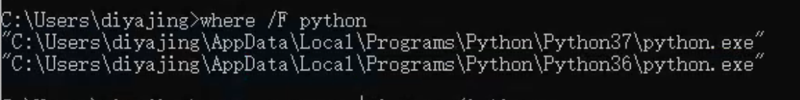
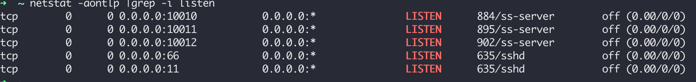
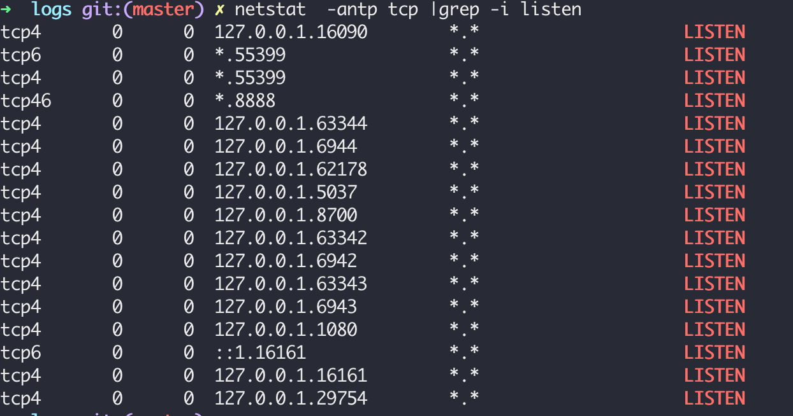

# windows 查询tcp端口监听

> 这个命令可以查看本机监听的所有tcp 监听

`netstat -aont |findstr /i listen`

备注:
 * netstat 是windows下的命令; 可以使用netstat /? 查看参数的帮助
 
 * findstr 也是windows下的命令; 通过 findstr /? 查看
 * 此处在cmd 里面可以用 where /F netstat 查看命令路径
 
 * linux 下面的netstat 执行有所不同: `netstat -aontlp |grep -i listen`

 * macos 下面的netstat: ` netstat  -antp tcp |grep -i listen`
 
 * https://zh.wikipedia.org/zh-hans/TCP/UDP%E7%AB%AF%E5%8F%A3%E5%88%97%E8%A1%A8
 
# 代理的种类
 - http代理: 常用代理http的访问
 - socks代理: 可以代理tcp
 - socks5代理: 在socks基础上加入了dns远程解析功能

# 代理的用途
 - fiddler, charles, postman等抓包
 - 内网访问, 如一些不能直接访问服务器的服务
 - 代理访问

# windows 代理的设置
 - Win键+R: 或者在cmd中输入 inetcpl.cpl 打开Intent属性 设置pac代理和http socks代理等`inetcpl.cpl ,4
`
 - 一些软件自带代理设置的选项; firefox等
 - cmd环境或者bash等环境访问;
 - chrome 可以安装插件SwitchyOmega 配置代理等
